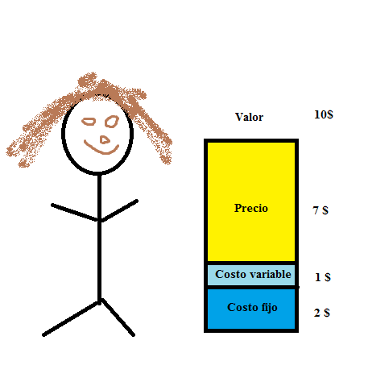

Creo que estamos expuestos a un sinfín de teoría que parece no tener sentido. El contexto de aquello que nos bombardea no es el mismo al nos sometemos; los sistemas, los procesos, el ambiente y los objetivos son diferentes.

Por ello, este ensayo nace con el propósito de esclarecer el concepto y la utilidad del valor y las estructuras de precio en las organizaciones. A mi parecer, la equivocada concepción de estos términos es una práctica que cada vez se da con más frecuencia, -y también- uno de los mayores problemas que enfrentan las entidades comerciales. No es raro que una empresa coloque un mal precio, es de hecho una práctica común y uno de los motivos que –eventualmente- provocan un nulo crecimiento, una incapacidad para re-invertir el valor y la eventual quiebra de una empresa.

El precio va más allá del mercado, el precio es una estructura donde coexisten elementos y que dicha estructura es la que te ayuda a saber cómo empaquetar tu producto, que precio colocar, cuando ofertar, cuando competir, etc.

> Definiendo el valor 

En la historia, el significado de valor se ha tratado de explicar a través de la economía. Existen dos grandes pensamientos; el primero -y más antiguo- es el pensamiento económico clásico donde se propuso la teoría del valor-trabajo y que sostiene que el valor de un producto depende de los esfuerzos (costos) con los que se construyó dicho producto. Esto quiere decir que -a mayor esfuerzo, mayor es el precio-. En esta línea de tiempo podemos encontrar a personajes emblemáticos como Adam Smith, David Ricardo y Karl Marx.

A mediados del siglo XIX nace una respuesta al pensamiento clásico, y este es el pensamiento austriaco. Aquí se propone la teoría del valor subjetivo donde se sostiene que -el valor de una mercancía no depende de los esfuerzos-, sino de la utilidad que brinda al individuo. Es decir, el valor es la subjetividad del agente económico para con tu producto (en términos monetarios) y su disponibilidad de pago. Carl Menger lo explica muy bien:

> “La subjetividad es la percepción y valorización personal y parcial sobre un asunto, idea, pensamiento o cultura. La subjetividad se asocia a la incorporación de emociones y sentimientos al expresar ideas, pensamientos o percepciones sobre objetos, experiencias, fenómenos o personas. El valor de los bienes por lo tanto es subjetivo y se fundamenta en la relación de los bienes con nuestras necesidades, no en los bienes mismos. Según varíen las circunstancias, puede modificarse también, aparecer o desaparecer el valor.”

Imagina que quieres montar un restaurante, y para ello desarrollas un estudio y averiguas el valor que percibe tu segmento. Digamos que tu segmento está dispuesto a pagar un valor de 10$ por platillo, entonces tú rango tiene un mínimo de 0$ y un máximo de 10$ dólares.

Entonces, te costaría producir 3$ cada platillo (sumando tus costes fijos y variables), esto te da un (en amarillo) de 7$ donde puedes colocar un precio.  Todo este rectángulo -desde el precio hasta el costo fijo o viceversa- está dentro del valor que tu segmento está dispuesto a pagar por tu producto. 

Visualizar y entender este rango (valor) te permite construir un producto respetando el valor de tu segmento y su disponibilidad de pago, obtener ganancias para re-invertir y por consecuencia seguir generando valor. Podemos decir que el propósito de una compañía es mantener ese valor, encontrar más valor (a través de acciones o nuevos productos) y seguir rascando esa “subjetividad” de mercado que les permita crecer.

Creo que hemos aterrizado con éxito el concepto de valor así que es tiempo adentrarnos a la estructura de precios.

La idea del siguiente bloque es que entiendas el approach de estructuras para que no te limites solo al enfoque de mercado (como siempre nos han enseñado), sino que también tomes en cuenta los elementos que coexisten dentro del precio; costos variables, costos fijos, estrategia, disponibilidad de pago, etc. Por cierto, la estructura y la fijación de precio la veremos en siguientes entradas así que te sugiero suscribirte para no perdértelo.

> Estructura de precios

El precio es el monto que esperas recibir por un producto que vendes, mayormente representado por una unidad monetaria (en algunas partes del mundo son cabezas de ganado)

A su vez, la estructura de precios es un enfoque que muestra la relación de tu fijación de precios para con tu producto. La estructura abarca 4 elementos:

Valor —> Características —> Costes —> Precio

* El trabajo del valor es averiguar cómo te perciben y su disponibilidad de pago.

* El trabajo de las características es averiguar que quiere tu segmento de mercado y cuantos tipos de clientes tienes ahí, y con esa información empaquetar tu oferta acorde a las necesidades específicas de cada uno de las personas del segmento.

* El trabajo de los costes es saber cuánto te va costar conseguir ese valor y si es factible perseguirlo.

* El trabajo del precio es darte un margen que sirve para re-invertir y seguir persiguiendo ese valor.

La estructura no es solamente un esquema que te muestra la dinámica de tus elementos y su relación, también cumple con propósitos de flexibilidad, escalabilidad y crecimiento. 

Flexibilidad.- Es la parte que te permite implementar cursos de acción relacionadas con tu objetivo, este objetivo puede ser el penetrar un mercado o el obtener más ganancias. Recuerda que si tu objetivo cambia, también lo hace tu estructura (por ello se necesita de flexibilidad).

Escalabilidad.- Es la parte que está compuesta por dos cosas; la primera es que a medida de que crezcas, tus costes no superen tus precios. La segunda es que el crecimiento no afecte tu precio y te permita obtener una ganancia (del valor) que puedes re-invertir en tu organización.

Crecimiento.- El enfoque del crecimiento es el jugar con tu precio, es la parte que te permite empaquetar tu producto para llegar a más consumidores, las ofertas que puedes crear o los descuentos que puedes implementar.

La estructura y sus propósitos te ayudan a  responden preguntas tales como:

* ¿Qué descuentos puedo ofrecer?
* ¿Cómo puedo mejorar mi modelo de negocio?
* ¿Qué puedo hacer para entrar a x mercado?
* ¿Qué acciones puedo tomar sin afectar mis finanzas de forma negativa?

Como dije anteriormente, este approach no solo te permite observar la dinámica, también te permite perseguir objetivos, establecer ofertas, descuentos o estrategias.

Imagina que tienes una empresa que ofrece masajes y deduces que existen tres personas en tu segmento:

1. Los que solo quieren un masaje.
2. Los que quieren un masaje y aromaterapia.
3. Los que quieren masaje, aromaterapia y un baño. 

En la imagen, lo que está en café son tus costos por masaje, antes de eso pierdes dinero (suponiendo un break even), después de eso ganas dinero.

Lo que está en verde es tu rango y es todo el espacio que tienes permitido para fijar tus precios. Cada segmento tiene un rango y unos costos diferentes, la razón es que el valor aumenta dependiendo la subjetividad de tu segmento.

Lo anterior es Valor —> Características —> Costes

Falta el precio, ¿cierto? Bueno, eso lo explicare en el siguiente bloque. 

> Estrategia de precios 

La estrategia de precios es la fijación de un monto puramente enfocado al mercado, complementa la estructura de precios y en términos concretos; ayuda al empaquetado, colocación de ofertas y descuentos. Siempre tomando en cuenta el contexto de tu empresa y necesidades del cliente.

Los tipos de estrategia son los siguientes:

> ##### **Precios singulares/de tarifa plana**

Estas son las estructuras donde se establece solo un precio, por lo regular solo sirven a un tipo de cliente específico. Aunque sean estructuraras basadas en un solo precio, no significa que el precio deba ser estático, siempre puede actualizarse dependiendo la dinámica del mercado (clientes/competidores)

En estos momentos Amazon Prime se encuentra penetrando el mercado de México, la idea es generar una base que sea leal y después moverse a la siguiente etapa. Se trata de que Amazon usa su musculo financiero, esto significa el beneficio (por tu parte) de un periodo de sus planes, esto crea la “dependencia” necesaria para poder aumentar los precios y disminuir tu sensibilidad así como aumentar tu tolerancia a los cambios. 

> ##### **Precio con múltiples opciones**

Su nombre lo dice, es la estructura que ofrece múltiples opciones para diferentes tipos de segmentos. Es una estructura exitosa en los modelos de suscripción, y la más regular. Por cierto, aquí estaba lo que comentaba en el punto anterior. En Estados Unidos ya se encuentran en múltiples opciones. Es más complejo de lo que escribo aquí pero el ejemplo es para dar una idea de las estrategias, no para desestructurar todo el long-term price de Jeff Beziiitos.

> ##### **Precios variables**

La estrategia de precios variables responde al volumen de compra o tráfico que manejes. Por lo regular, estos precios vienen acompañados de equipos de venta y soporte con los que hablas para que ellos te ofrezcan algo acorde a tus necesidades y volúmenes.

> ##### **Precios por usuario**

Esta estructura hace referencia al cobro por cantidad de usuario agregados a un plan. Se da en empresas que venden software como servicio pero enfocadas a equipos de trabajo. Notion es un ejemplo de ello, después de ciertos usuarios empieza a cobrarte una tarifa.

Se puede implementar más de una estrategia por empresa, muchas empresas lo hacen. Pero eso no significa que tú lo debas hacer, la estructura cambia dependiendo el objetivo de la empresa. Te recomiendo suscribirte ya que profundizare este tema en las siguientes entradas, la idea de esta publicación es aterrizar el valor, la estructura y la estrategia de precios. Sin lo anterior es difícil entender el proceso de fijación de precios.

Por ultimo, te dejo una ultima cita de Patrick Campbell, CEO de ProfitWell:

> Toda estructura de precios comienza con un objetivo de precios. Cambie el objetivo, y tendrá que cambiar la estructura también. Ya sea que intente entrar en un campo competitivo, vendiendo un producto de alto valor y/o muy innovador, atendiendo a una amplia gama de compradores o jugando en un campo estrecho, adapte su estructura de precios en consecuencia.