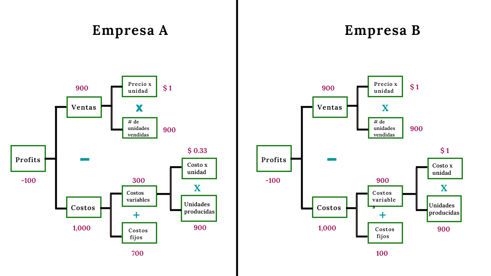
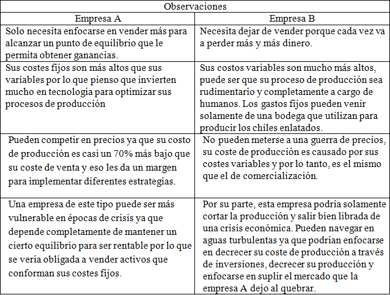
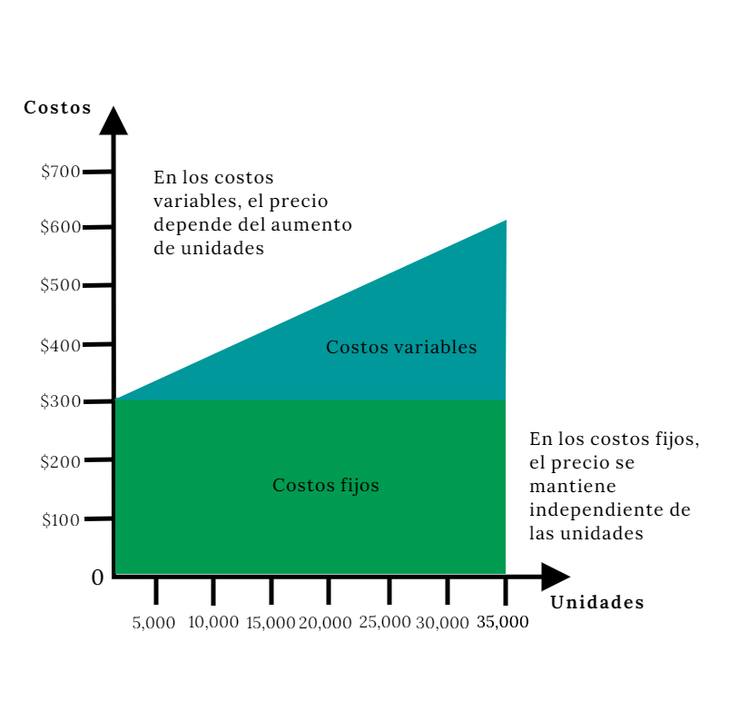
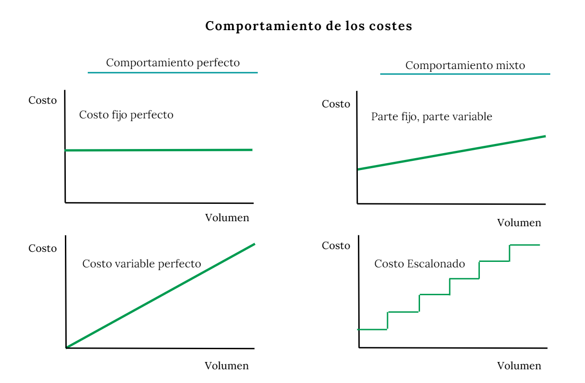
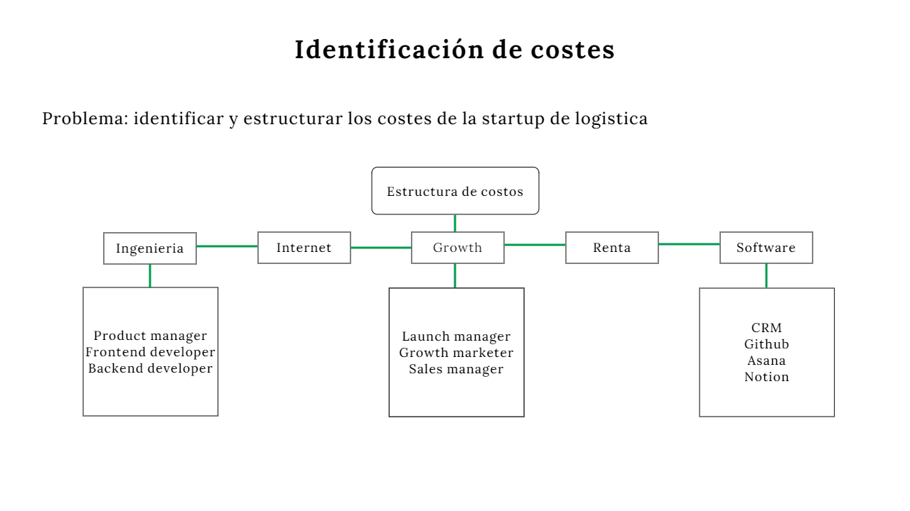
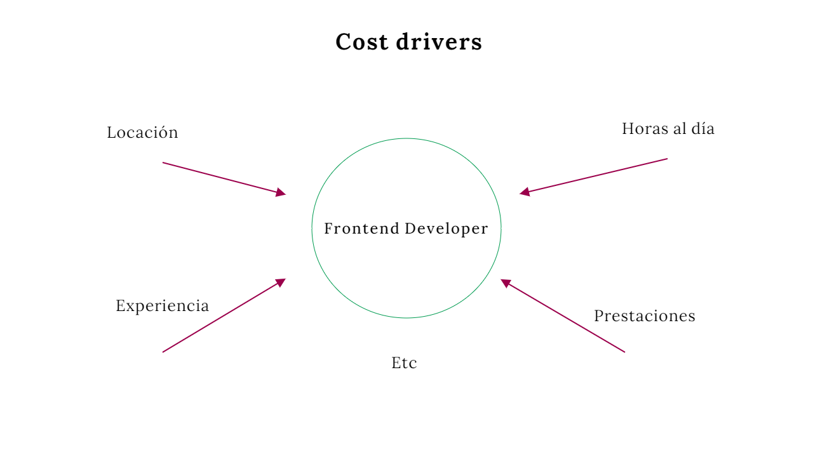
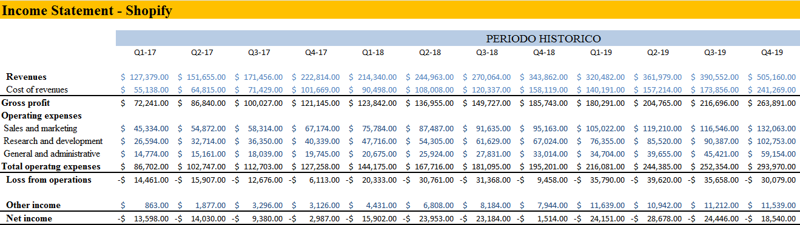
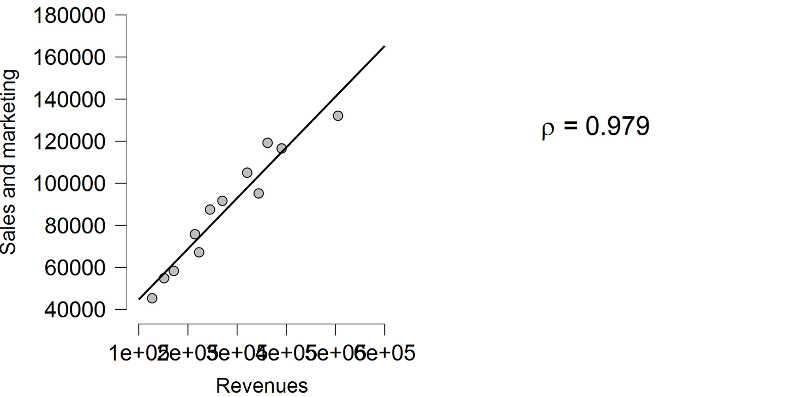
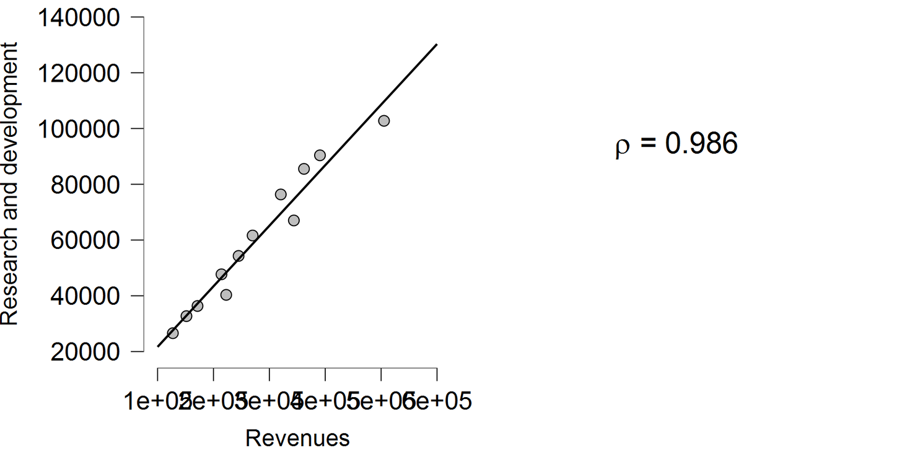
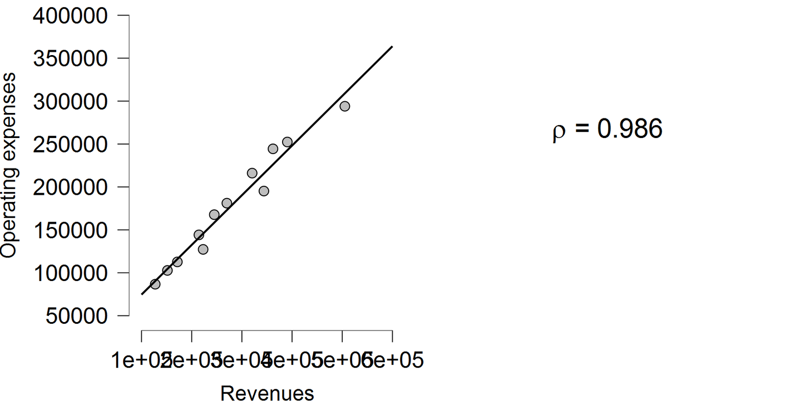

Para explicar lo que es una estructura de costes creo que primero debemos entender el significado de lo que es un costo. Para mí, un costo es “algo” que entregamos en modo de inversión y -a la vez- una acción que busca un objetivo o cosa en particular. Para las empresas, ese objetivo o cosa en particular puede ser el fabricar un bien u ofrecer un servicio, o bien puede ser el costear acciones para comercializar un producto a través de marketing o también el desarrollar ese producto desde ingeniería. Por lo tanto, si nos ponemos románticos podríamos decir que un coste es el sacrificio que hacemos por el valor que tanto anhelamos y perseguimos.

> #### **Estructura de costos**

Por su parte, una estructura es el modo en que está organizado un conjunto de costos que se relacionan entre sí. Esta estructura te permite visualizar y entender los costes en los que incurre tu empresa en pro de conseguir un beneficio. La idea detrás de la estructura es obtener una –macro perspectiva- que permita entender la dinámica de tus costes, y con ello poder comparar (con otras empresas), optimizar/mejorar o entender donde estas fallando.

Veamos un ejemplo de profitability:

Este es un framework estándar que se utiliza para comprender como una empresa hace dinero. En este caso utilizaremos el framework para visualizar y comprender la mecánica dentro de los costes y la diferencia que podemos notar al comparar una empresa con otra.

Supongamos que la única información que tenemos es que la empresa A y B compiten en el mismo sector y se dedican a comercializar chiles enlatados.

Estas son las observaciones que noto al ver la estructura del ejemplo anterior (bastante simple, por cierto): 

Uno de los poderes de la estructura es que te ayuda a entender como funcionas pero también te pone en un contexto que puedes usar a tu favor. Un entendimiento de este tipo te da un espacio para maniobrar en diferentes escenarios, al mismo tiempo que ayuda a colocar un precio -gracias al margen que te muestra- y con ello poder utilizar ciertas estrategias así como una ventaja en términos comparativos (al analizarte con otra empresa).

> #### **Clasificación de costos** 

Como viste en el ejemplo, los costes se clasifican. La estructura está conformada por dos grandes bloques: 

* Los costos variables son aquellos relacionados directamente con la producción o demanda de un bien, es decir, estos aumentan o disminuyen con la interacción -del mercado- para con el producto.
* Los costos fijos son independientes de la producción y suelen ser estáticos hasta cierto volumen. Por ejemplo, el coste fijo puede aumentar si el límite de producción por m2 es superada, en casos como este se podría necesitar otro edificio para fabricar el producto en cuestión.

> #### **El comportamiento de los costos** 

Los costos también tienen comportamientos y suelen saltarse algunas reglas -generalmente conocidas- como el crecimiento perfecto del costo variable o la estabilidad del costo fijo.

Por ejemplo, piensa en un equipo de servicio al cliente. Un equipo de este tipo tiene cierta capacidad para atender a un determinado numero de clientes, puedes contar con 5 personas para atender 100 dudas a la semana, si esas dudas crecen a 200 semanales, probablemente necesitas adherir más personas.

Pero, ¿como clasificarías este costo? no podrías ponerlo en variable o en fijo, el comportamiento no es perfecto, y encima no lo sabes ya que podrías adherir nuevos canales para atención al cliente y eso podría darle aún más fricción a la capacidad instalada.

Supongo que podríamos ponerlo como algo escalonado, es decir, nuevas personas podrían ocupar un nuevo espacio fijo (que se mantiene hasta no adherir más personas) y un aumento en la demanda en algún software (que aumenta exponencialmente dependiendo el numero de personas), o sea, un coste de comportamiento escalonado.

Pero la verdad es que no hace falta que te rompas la cabeza con el comportamiento. Existe un método que nos puede ayudar a medir con mayor exactitud.

> #### **Identificación de costos** 

Para identificar tus costes necesitas tres cosas: 

1. Conocer tu negocio y entender a dónde quieres llegar
2. Plasmar una estrategia y estructurar tu estrategia con el fin de llegar al lugar que quieres
3. Identificar los procesos y drivers que afectaran esa estructura

En esta parte abordare un ejemplo que nos permitirá explicar mejor los puntos anteriores.

Imagina que notaste una fricción en el sector logístico, más en específico en el mercado de envíos nacionales por carretera. Lo que encontraste es que las empresas logísticas no aprovechan eficientemente sus recursos. En muchas palabras, los transportistas realizan viajes con mercancía que descargan en ciertos puertos de tú país pero regresan a su HUB de origen sin cargamento, o sea que desaprovechan ese viaje de retorno pudiendo traer mercancía.

Ahora que notaste un problema, solo queda crear un producto que le permita a los transportistas o empresas logísticas el emparejarse con personas que quieran enviar cargas al lugar de origen de los transportistas.

La idea detrás de este producto es ayudar a los transportistas a que aprovechen mejor su viaje de regreso conectando con personas que tengan necesidades de transporte, al mismo tiempo que les ayudas a generar más ingresos.

En este punto te toca entender cuáles son los costes de crear esta estructura. Este ejemplo se encuentra en una etapa temprana, por lo tanto el dilema del huevo y la gallina sería un escenario esperado. El dilema significa que tienes que tomar una decisión acerca de si atraer primero a tu oferta (transportistas) o atraer primero a tus consumidores (personas que necesitan un transporte de mercancía).

Digamos que haces lo mismo que el 99% de los mercados digitales. Por lo tanto, tu primer paso debería ser enfocarte en conductores y después en los consumidores -al mismo tiempo que desarrollas tu producto-.

Hasta ahora hemos entendido a donde queremos llegar y cuál es nuestra estrategia. 

> #### **Entendiendo la estructura** 

Creo que las actividades clave de nuestra estrategia son Ingeniería y Growth. Necesitamos no solo atraer personas, sino también necesitamos desarrollar el producto acorde a las necesidades de nuestro segmento.

Para este caso vamos a utilizar el approach estrategia-estructura ya que nos permite dinamizar y entender mejor como y cuanto nos costara perseguir ese valor del que tanto hablamos en la parte 1 y del que profundizaremos en la parte 3.

Aquí tenemos un ejemplo de identificación:

Como lo mencione anteriormente, necesitamos de ingeniería y de growth. Puedes ir tan profundo como quieras con tal de entender e identificar tus costes, -tanto en este como en el siguiente apartado-.

Ahora que entendemos nuestra estructura sus costes, creo que es tiempo de pasar al siguiente concepto.

> #### **Cost Drivers** 

Una vez que identificamos nuestros principales costes estratégico-estructural, es tiempo de entender aquello que los detona.

Un cost driver puede ser definido como la unidad que altera nuestro coste, estas alteraciones pueden significar en un aumento o disminución de precio. En una viga de acero; un cost driver puede ser lo largo de la viga o el peso de la misma.

Pero dentro de nuestro ejemplo, el cost driver de un desarrollador frontend puede ser lo siguiente:

* La experiencia determina el sueldo
* Las horas al día determina cuanto costara el recurso humano dentro de un determinado periodo de tiempo 
* La locación puede ser otro factor ya que tal vez necesita trasladarse a las oficinas centrales 

Interesante approach, ¿cierto? Ahora es tu turno de desarrollar tu estructura, puedes ir tan profundo como tu quieras.

Tranquil@, en la siguiente parte del ensayo hablaremos sobre la fijación de precios y profundizaremos en la identificación de los costos así como en los cost drivers y otros puntos interesantes, no te lo pierdas. 

> ### El caso Shopify

En esta parte hablaremos de un caso especial, en pocas palabras quiero mostrarte la correlación que existe entre los costos y las ventas de una empresa.

Antes de empezar quiero aclarar ciertos terminos:

* Un modelo estadístico busca observar, analizar y someter los datos a una serie de investigaciones y técnicas con el objetivo de entender e interpretar de mejor manera la información que estos estos datos proveen. 

En este caso usaremos un modelo de correlación el cual nos ayuda a entender la relación entre dos o más variables. 

* Las variables son características/atributos que pueden cambiar o no cambiar de valor. 

Por ultimo:

* Un modelo financiero es casi lo mismo que un modelo estadístico en naturaleza pero con propositos algo diferentes, pero por ahora quedémonos con que también busca entender e interpretar de mejor manera la información. 

> #### **Empecemos** 

Primero capture los datos de los estados de resultado de Spotify durante 12 trimestres, empezando por el 2017. 

Con este modelo financiero obtuve distintas variables que sometí a un estudio de correlación:

> **Sales and marketing vs Revenue** 

> **Research and development vs Revenue** 

> **Total Operating Expenses vs Revenue**

> #### **En conclusión**

Identificar y estructurar -de acuerdo a tu estrategia- es lo más adecuado.

La correlación de este caso es casi perfecta, los costos de Spotify están fuertemente relacionados con sus ventas, por lo tanto es algo que deberías tener presente en un futuro.

Identificar y estructurar -de acuerdo a tu estrategia- es lo más adecuado.

Como dije al principio, un coste es el sacrificio que hacemos por el valor que tanto anhelamos y perseguimos.

Y en ocasiones ese sacrificio es bien remunerado.

¡Hasta la próxima!